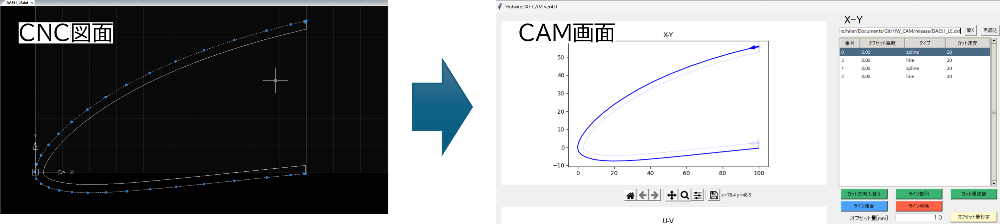
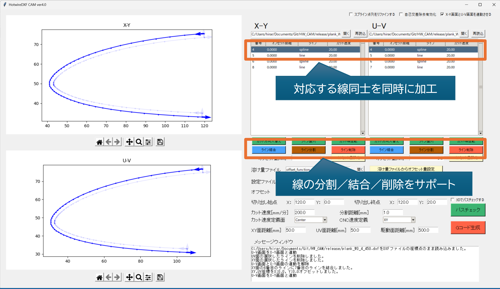
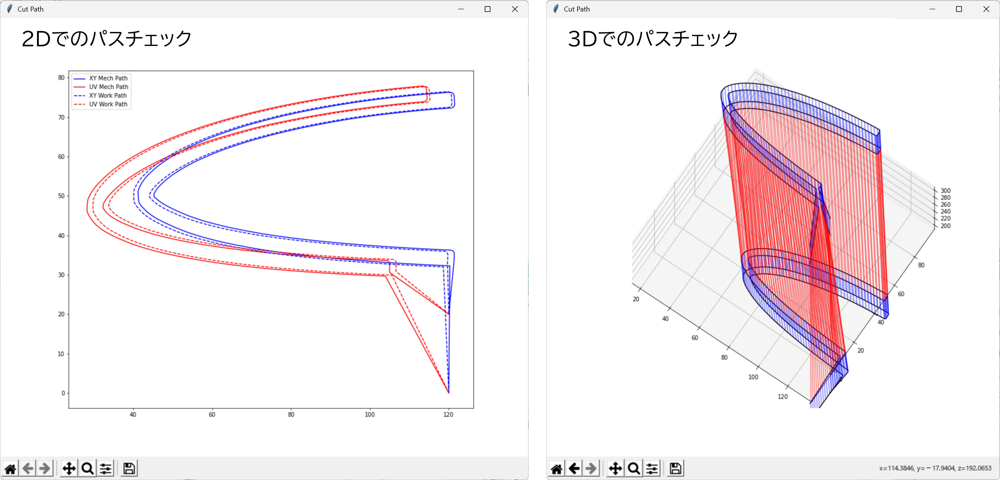

# HW CAM (Hotwire CAM Software)
本ソフトウェアは、オープンソースの熱線カッターCNC向け2D CAMソフトウェアです。

## 概要
本ソフトウェアは、4軸熱線CNC向けの簡易CAMソフトウェアです。
ユーザーが作成した異なる2つのDXF図面を取り込み、各種補完処理等を行ったうえで、4軸熱線CNC向けのGコードを生成できます。

## 特徴
### シンプル＆省力
人力飛行機のような加工部品が多い用途に向けて、CADでできる処理はCADに任せる思想です。本ソフトでは、最短で以下の2ステップでGコードを生成できます。
1. DXFファイル読み込み
2. Gコード生成

### DXF直読み込み
2つの断面を作図したDXFファイルを直接読み込むことができます。ユーザーは加工したい形状の右側と左側の断面を2D CADで作図し、本ソフトウェアにインポートできます。これにより、2D CADのみを用いて熱線加工が可能になります。

### 上下異形状加工
加工物の断面は、異なる形状の場合でも、補完処理によりGコードを生成できます。これにより、捻り下げ、翼型混合、テーパー翼等を加工できます。

### 同時通過点指定
上下異形状可能の場合、同時通過点を指定しないと、意図した形状に加工できません。本ソフトウェアでは、CADから読み込んだ線同士を対応させ、それぞれの線の端点を同時に通るように補完処理を行うことで、複雑な形状な加工に対応します。
CAD図面では、加工時の線同士の対応を意識していない場合がほとんどですので、CAM側で線の結合／分割をサポートしています。

### 溶けしろ補正（工具径補正）
熱線加工では、加工時に材料が溶けるため、CAD図面で作図した形状より、実際の形状は小さくなります。これを補正するため、読み込んだ点列を溶けしろ分だけオフセットする処理に対応しています。オフセット補正は、以下の方法に対応しています。
* **マニュアル補正**：XY面, UV面でそれぞれ溶けしろを手入力で補正できます。
* **自動補正**：加工速度vs溶けしろの相関ファイルを用意することで、加工速度から溶けしろを自動補正できます。

### 加工パスチェック
Gコード生成前に、2Dおよび3Dにて、加工パスを確認できます。

### Gコード生成
4軸CNCコントローラーに合わせたカスタムGコードを生成できます。インバート時間送り(G93)にも対応しています。
* **任意の座標軸名**：XYUV軸を好きな文字に指定できます
* **速度定義**：CNCコントローラーに合わせたFeed Rateを生成できます。

## 依存ライブラリ
* NumPy
* SciPy
* ezdxf
* matplotlib
* traceback
* os
* datetime
* tkinter
* sys

## インストール
本ソフトウェアは、EXEファイルまたはPythonスクリプトから実行できます。

### EXEファイルからの実行
1. 最新のreleaseをダウンロードする。
2. releaseフォルダ下にあるHW_CAM.exeを実行する

### Pythonスクリプトからの実行
1. 最新のreleaseをダウンロードする。
2. Pythonの3系がインストールされていない場合、Pythonの3系をインストールする。
3. 依存ライブラリに記載されたライブラリがインストールされていない場合、pip等を用いてPython実行環境へインストールする。
4. srcフォルダ下にある、HW_CAM.pyを実行する。

## 使用方法
以下を参照ください。

[ユーザマニュアル](https://github.com/Pakfat50/HW_CAM/blob/main/documents/README.md "ユーザマニュアル")

