:toc: left
:toc-title: 目次
:toclevels: 5
:sectNums:
:sectNumLevels: 5

= HW CAM ユーザマニュアル

== 概要

=== 一般的なワークフロー
本ソフトでの一般的なワークフローを下図に示します。

本ソフトでGコード生成するのに必須なのはCADファイルの読み込みと、Gコード出力です。CADファイルが単純な形状の場合や、加工パスを考慮して作成されている場合などでは、CADファイルを読み込んで、そのままGコード出力が可能です。

CADの作図上は考慮されていないものの、熱線加工上必要となる設定については、CADファイルの読み込み後に必要な補正をかけてから、Gコードを出力します。現バージョンで対応している補正は以下です。

* 同着点指定
* 加工順指定
* 工具径補正（溶け量補正）
* 加工条件指定
* ワーク断面からのCNC駆動面座標作成（テーパー加工の場合必要）
* ワーク座標オフセット／回転

image::res/ワークフロー.png[]

=== 画面の名称
本ユーザマニュアル内では、説明のため、画面内の要素を下図のように呼びます。

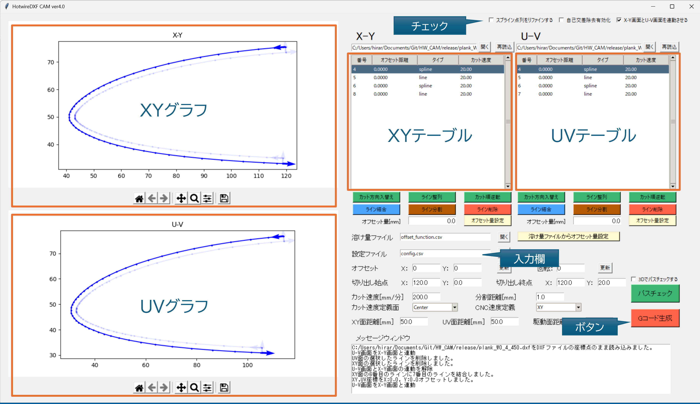

=== グラフの操作
画面左側には、CADから読み込んだ線がグラフとして表示されます。グラフの描画にはMatplotlibを用いており、グラフの移動／拡大・縮小などは、グラフ下のツールバーから可能です。

ツールバーのアイコンについては、
https://matplotlib.org/3.2.2/users/navigation_toolbar.html[Matplotlibのドキュメント]を参照ください。

TIP: アイコンは、同じアイコンを再度クリックすると、選択が解除されます。

=== テーブルの操作
テーブルには、グラフ内の線の情報が表示されます。テーブル内の行をクリックすることで、線を選択できます。テーブルの行は、エクスプローラーと同様に、「Ctrl+クリック」「Shift+クリック」にて、複数の線を同時に選択できます。読み込んだ線が多い場合は、テーブル右端のスクロールバーを用いて、スクロールできます。また、ある行を選択した状態で、「↑」「↓」矢印キーを押すことで、上の行または下の行へ移動することもできます。

== CADデータ読み込み
加工したい形状を作図したCADデータを読み込みます。CADデータは、dxfファイルのみに対応しています。

NOTE: dwgの場合は、任意のdwg-dxfコンバーターを使用して、dxfに変換した後、インポートしてください。

TIP: CAD図面内の線は、一筆書きとなるように、向き／並び順を自動整列した状態で読み込まれます、

=== 読み込み方法
CADデータを読み込むには、エクスプローラーを用いる方法と、ファイルパスを直入力する方法の2通りがあります。

==== エクスプローラーによる読み込み
X-Yテーブル　または　U-Vテーブルの上の「開く」ボタンをクリックすると、エクスプローラーが開きます。エクスプローラーから、読み込みたいdxfファイルを指定し、「開く」をクリックすると読み込まれます。

NOTE: X-Y、U-Vのそれぞれで読み込みを行ってください。同じ図面（矩形）を加工する場合も、２断面で読み込みを行ってください。

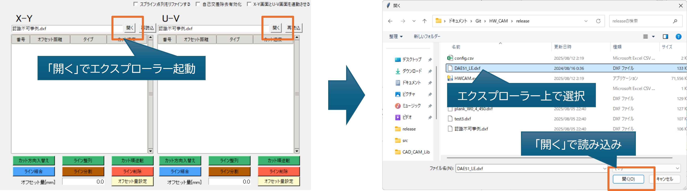

==== ファイルパスによる読み込み
X-Yテーブル　または　U-Vテーブルの上の空欄に、dxfファイルのパスを直に入力して読み込むこともできます。この場合、パスを入力後に「再読込」ボタンをクリックすると読み込まれます。

TIP: パスは、絶対パス、相対パスのどちらにも対応しています。

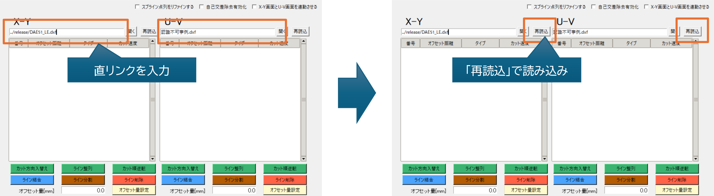

=== 座標点のリファイン
CADに取り込んだ翼型データの座標点数が少ない場合など、加工前に読み込んだ座標点を増やしたい場合があります。本ソフトでは、読み込み時に曲率に応じて座標点を細かく増やす機能（リファイン機能）を実装しています。「スプライン点列をリファインする」にチェックを入れたうえで、dxfファイルを読み込むことで、リファインした座標点でCAD図面が読み込まれます。すでにCAD図面を読み込んでいる場合は、「再読込」ボタンをクリックすることでリファインされます。

NOTE: リファイン時の補完方法は、一般的なCADやXFLRと同様に、3次スプライン補完です。

== 加工パスの指定
CADで作図された図から不要な線を削除したり、同着点を指定するように線を分割／結合したりすることで、加工パスを生成します。

本ソフトでは、X-YテーブルとU-Vテーブルに表示される同じ行の線の端点を同時に通るように加工パスを生成します。例えば、前縁で線を分割するようにすることで、前縁を必ず同時に通るような加工パスを生成できます。

NOTE: 翼型混合率の変化がきつい場合では、前縁を同着しないと捻れた形状になる場合があります。

=== 線の削除
CAD図面に不要な線が含まれている場合は、CAM上で削除できます。テーブル上で該当する線をクリックして選択した後に、「ライン削除」ボタンをクリックすると線が削除されます。

TIP: 複数の線を選択した状態で「ライン削除」をクリックすると、複数の線を同時に削除できます。

=== 線の結合
XY断面とUV断面のCAD図面において、線の分割位置が異なる場合は、線を結合することで分割位置を揃えることができます。テーブル上で結合したい線をクリックした上で、「ライン結合」をクリックすると選択した線が結合されます。

TIP: 複数の線を選択した状態で「ライン結合」をクリックすると、複数の線を同時に結合できます。

WARNING: ライン結合がうまくいかない場合は、「ライン整列」により一筆書きとなるように線を並び替えてた上で、ライン結合を行ってください。

=== 線の分割
同着点を増やしたい場合などのため、線を分割することができます。線の分割は、以下の手順で実施します。

. テーブル上で分割したい線を選択する
. 画面上で分割したい点をクリックして選択する
. 「ライン分割」ボタンをクリックする

TIP: ライン分割は、１本ごとに行ってください。

TIP: 選択していない線（色の薄い線）上の点は選択できません。

image::res/ライン分割.png[]

== 加工順序の指定
加工順序や向きが揃っていないと、下図のように捻れた加工パスが生成されてしまい、意図した形状を整形できません。XY断面とUV断面で線の加工順序および向きが揃うようにします。

image::res/加工順序.png[]

=== 最初に加工する線の指定
以下により、最初に加工したい線を起点として、テーブル内の線を並び替えます。

. テーブルにて最初に加工したい線を選択する
. 「ライン整列」ボタンをクリックする

TIP: 加工時の向きは、最初に選択した線の向きになります。これを変更する方法は、次項で説明します。

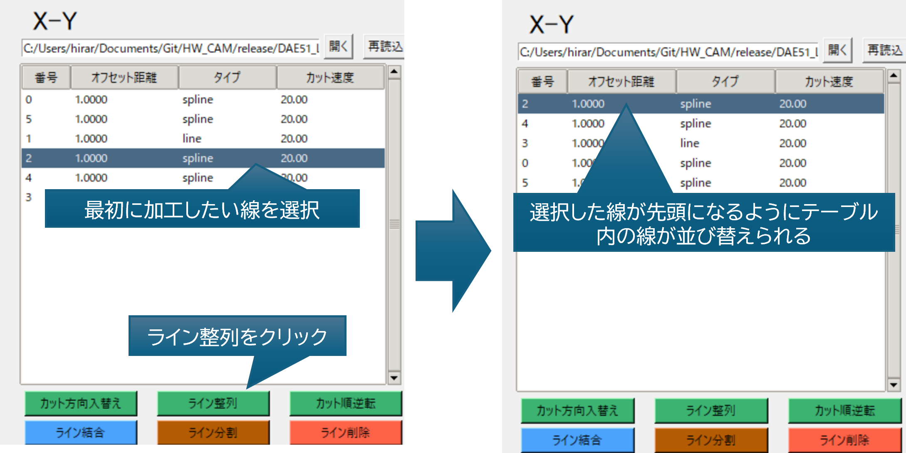

=== 加工方向の指定
加工を時計回りと反時計周りのどちらで行うかを指定します。

TIP: 加工方向は、グラフ上の矢印の向きで確認できます。直線は開始点のみ、スプラインは開始点と終点に矢印が表示されます。

==== 最初に加工する線の向きからの指定
「ライン整列」は、最初に加工する線の向きに合うように、残りの線が並び替えられます。よって、最初に加工する線の向きを、加工したい方向に向けておくことで、加工方向を指定できます。以下により、加工方向を指定します。

. テーブルにて最初に加工したい線を選択する。
. 加工したい方向と逆向きの場合、「カット方向入れ替え」ボタンをクリックし、線の向きを入れ替える。
. 「ライン整列」ボタンをクリックする

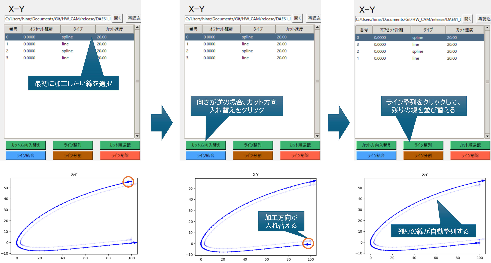

==== カット順反転による指定
時計回りと反時計周りを入れ替えたい場合は、「カット順逆転」ボタンにより、加工方向を反転できます。

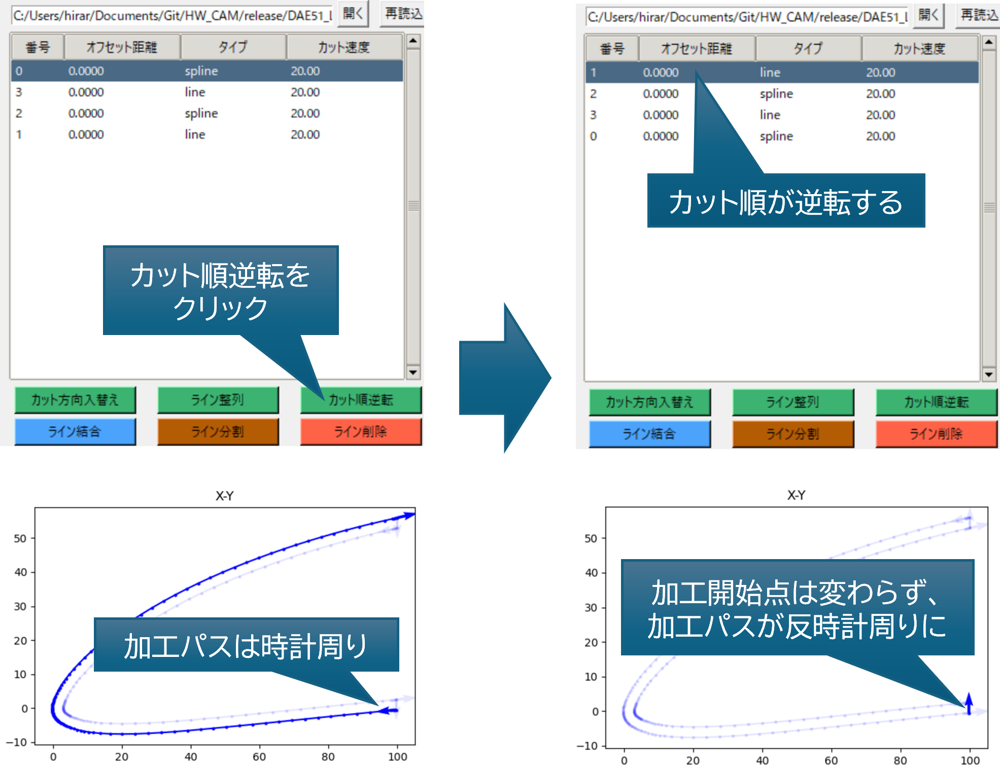

=== XY-UV画面連動による加工順の確認
「X-Y画面とU-V画面を連動させる」にチェックを入れると、XYテーブルの操作とUVテーブルの操作が同期します。同期した状態で、上から順に線を選択していくことで、線の対応関係が一致していることを確認できます。

なお、「X-Y画面とU-V画面を連動させる」にチェックを入れると、以下のボタンの操作も連動します。

* カット方向入れ替え
* ライン整列
* カット順逆転
* ライン結合
* ライン削除
* オフセット量設定

== 工具径補正
CAD図面で作成した形状を外側にオフセットすることで、熱線での溶け量を補正します。補正方法としては、オフセット量を手入力する方法（マニュアル補正）と、カット速度から自動補正する方法の２通りがあります。

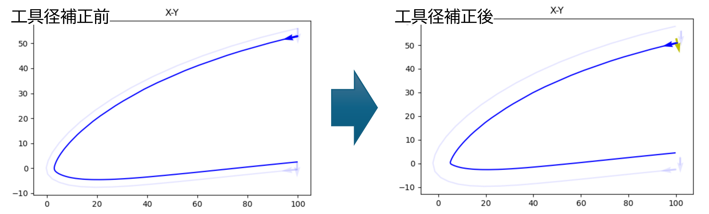

=== マニュアルによる補正
熱線による溶け量分をマニュアルで補正します。XY断面、UV断面でそれぞれ別々のオフセット量を設定できます。補正手順は以下です。

. 「オフセット量」欄にオフセットしたい距離を入力する。
. 「オフセット量設定」をクリックする。

NOTE: グラフおよびテーブルには、現在設定されているオフセット量が反映されます。

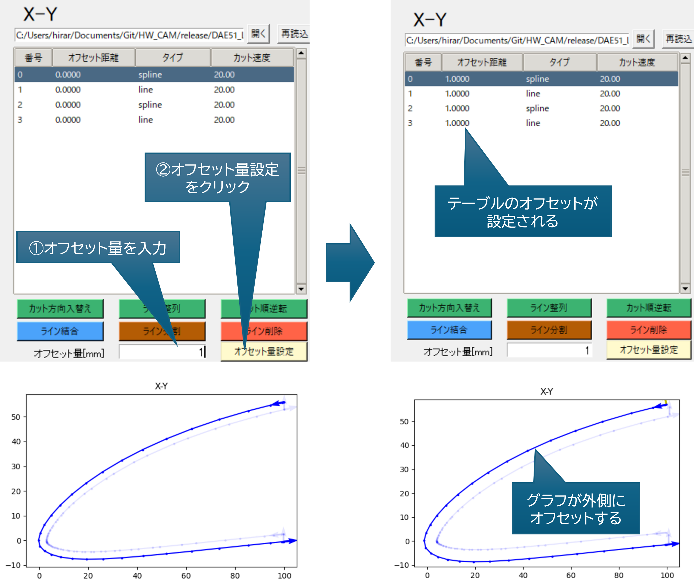

=== カット速度による自動補正
熱線による溶け量は、カット速度が速いと小さくなり、遅いと大きくなります。ユーザーが事前に「カット速度 vs 熱線による溶け量」の対応関係を溶け量ファイルとして作成しておくことで、CAM側でオフセット量を自動で計算し、線ごとに設定します。

==== 溶け量ファイルの作成（事前準備）
溶け量ファイルは、csvファイルとして作成します。作成例は、「offset_function.csv」を参考にしてください。value列は、必要に応じて列数を増やすことができます。

TIP: 溶け量ファイルのカット速度は、単調増加としてください。

NOTE: 溶け量の値は線形補完されます。

NOTE: 溶け量ファイルのカット速度外の速度をCAM側で設定した場合、端点の値が外挿されます。（例：下図でCAMにて200mm/minを指定した場合、溶け量は0.5mmが使用されます）

==== 溶け量ファイルの読み込み
「溶け量ファイル」の横の「開く」ボタンをクリックすると、エクスプローラーが立上がります。エクスプローラーにて、事前に作成した溶け量ファイル（.csv）を指定します。読み込みに成功すると、メッセージウィンドウに、読み込み成功と表示されます。

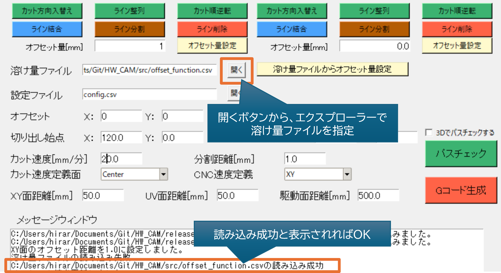

==== カット速度の指定
自動補正の場合、CAM側で計算されたカット速度から溶け量を計算するため、カット速度を設定します。カット速度の設定方法は、「加工条件設定」項を参照ください。

==== 自動補正の適用
「溶け量ファイルからオフセット量設定」ボタンをクリックすることで、自動でオフセット量が設定されます。

=== 自己交差除去機能
前縁の内側ような曲率がきつく、Rが小さくなる方向にオフセットする箇所では、下図のような自己交差が発生する場合があります。本ソフトでは、自己交差を除去する機能を設けてあります。

自己交差を除去する手順は以下の通りです。

. 「自己交差除去有効化」にチェックを入れる
. マニュアル補正の場合は「オフセット量設定」、自動補正の場合は「溶け量ファイルからオフセット量設定」ボタンをクリックする（オフセット処理を更新）

TIP: 自己交差を除去した場合、CADの形状と齟齬が発生する場合があります。自己交差除去した線は、メッセージウィンドウに表示されますので、更新後の形状に問題ないかを確認ください。

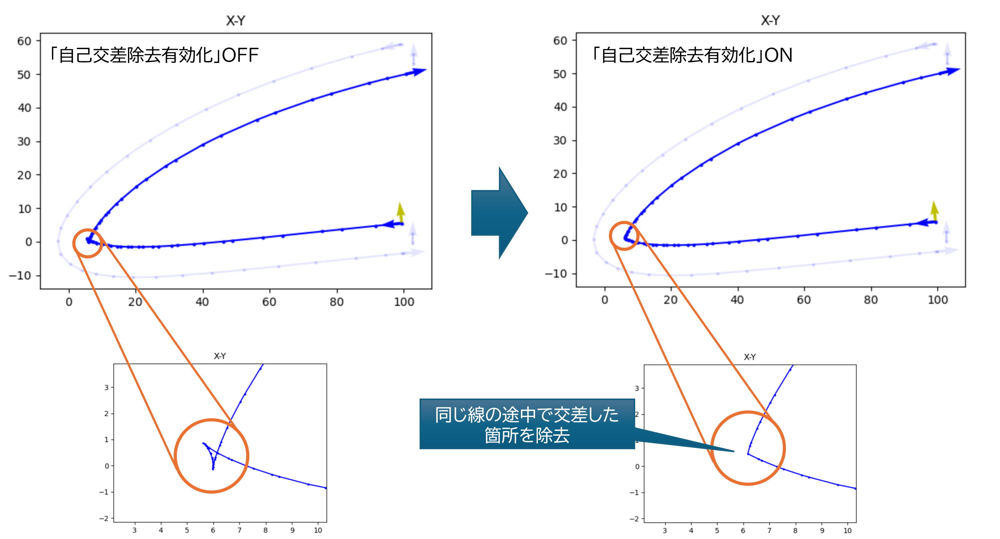

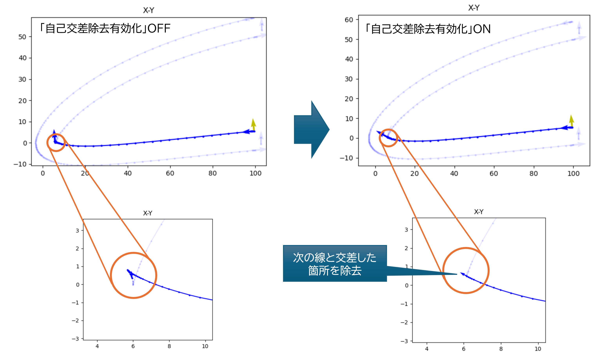

== 加工条件設定
各種加工に必要な設定を行います。

=== 座標設定
本ソフトでは、CAD図面の座標のオフセットと回転をサポートしています。

TIP: XY座標とUV座標の相対座標がずれないように、オフセットと回転はXY・UVで同じ量だけ適用されます。

==== 原点のオフセット
元の図面の原点をずらしたい場合は、以下により原点をオフセットできます。

. 元の図面をX方向、Y方向にオフセットしたい量を、「オフセット」欄に入力する
. 「更新」ボタンをクリックする

TIP: オフセット量は、「元の図面からのオフセット量」を表しています。0を入力すると、元の図面の原点に戻ります。

TIP: 原点のオフセットは、XY／UVの両方の図面が読み込まれた後でないと適用できません。

==== ワークの回転
元の図面を回転したい場合は、以下により回転できます。

. 元の図面を回転したい量を、「回転」欄に入力する。
. 「更新」ボタンをクリックする。

TIP: 回転量は、「元の図面からの回転量」を表しています。0を入力すると、元の図面に戻ります。

TIP: 回転は、図の重心（X座標／Y座標の平均値）を回転中心として行われます。線を削除した場合は、回転中心がズレます。この場合は、適宜オフセットにより補正してください。

TIP: 回転は、XY／UVの両方の図面が読み込まれた後でないと適用できません。

=== 加工始点・終点の指定
加工の開始座標と終了座標を設定します。「切り出し始点」「切り出し終点」に入力した座標が加工始点・終点となります。

image::res/始点・終点IF.png[]

NOTE: 加工始点から最初に加工する線まで、および最後に加工する線から加工終点までは、直線で移動します。このとき、ワークと干渉しないように始点・終点の座標を設定してください。（下図）

NOTE: 加工始点までの移動はG00（早送り）、それ以降の移動はG01（直線移動）にてGコードが生成されます。

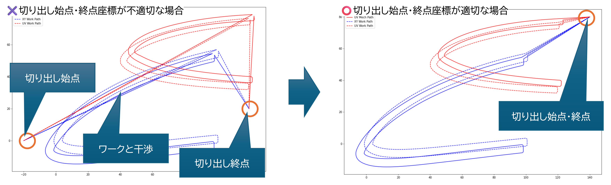

=== 加工対象／CNC情報の入力
Gコード生成のため、加工対象とCNCの情報として、下表の内容をCAMに設定します。

|===
|設定値 | 説明
|XY面距離 
|CNCのXY駆動面とワーク端面(XY断面のCAD図面)までの距離

|UV面距離
|CNCのUV駆動面とワーク端面(UV断面のCAD図面)までの距離

|駆動面距離
|CNCのXY駆動面とUV駆動面の間の距離

|===

各距離の定義については、下図も併せて参照ください。

CAMでは、以下の場所に入力します。

=== カット速度の指定
4軸CNCでは、カット速度の定義が複雑です。意図したカット速度で加工を行うためには、以下を考慮する必要があります。本ソフトでは、それぞれについて設定できるようにしています。

* CAMにおけるカット速度を定義する断面の位置
* CNCコントローラーのFeedRateの解釈方法

==== CAMにおけるカット速度の指定
テーパーがかかっている形状を加工する場合、XY断面／UV断面での速度は異なることになります。加えて、ワーク端面とCNCマシンの駆動面でも速度が異なります。本ソフトでは、カット速度の定義面を変更できるようにしてあります。

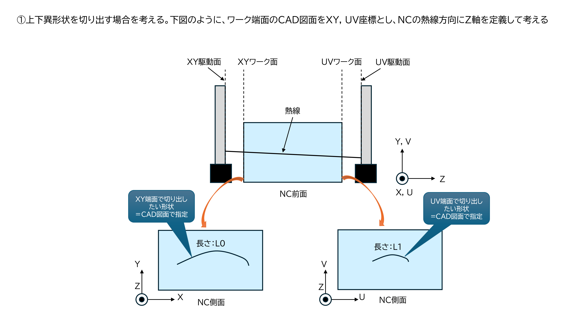

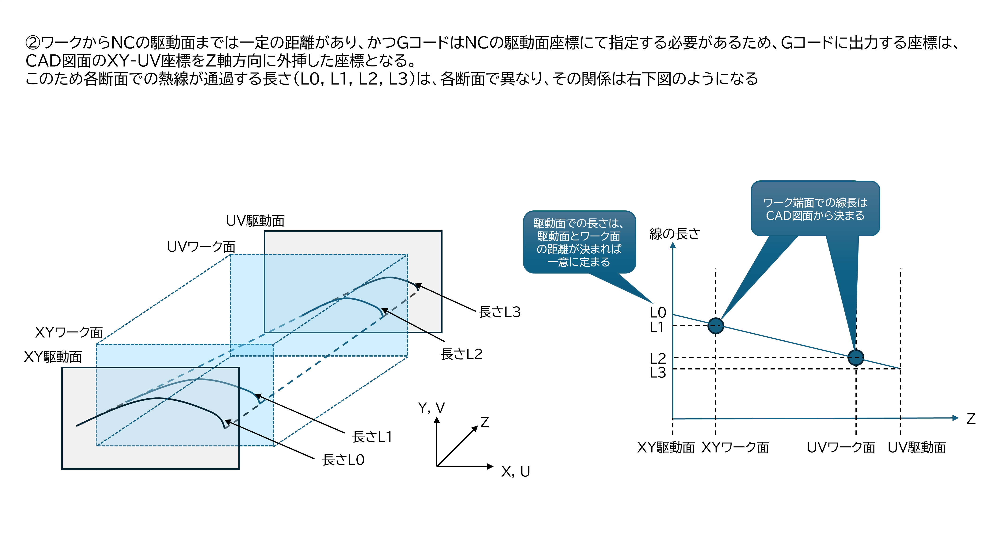

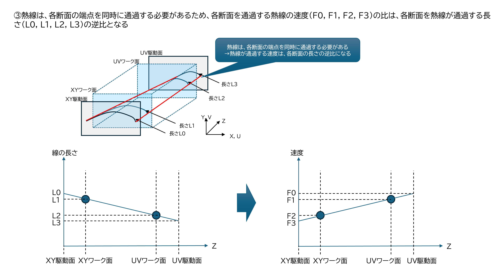

カット速度を指定するには、以下を設定します。
. 「カット速度」欄に設定したいカット速度を入力する。
. 「カット速度定義面」のドロップダウンリストから、カット速度の定義面を選択する。ドロップダウンリストのメニューの意味は下表の通りです。

|===
|メニュー名 |定義面 | 説明

|XY(Mech)
|XY側CNC駆動面速度
|XY座標面側のCNCのアクチュエータの移動速度

|XY(Work)
|XYワーク端面速度
|XYワーク端面(XYのCAD図面)における移動速度

|Center
|ワーク中央速度
|ワークの中央における移動速度

|UV(Work)
|UVワーク端面速度
|UVワーク端面(UVのCAD図面)における移動速度

|UV(Mech)
|UV側CNC駆動面速度
|UV座標面側のCNCのアクチュエータの移動速度
|===

NOTE: ドロップダウンリストの値を変更すると、テーブル内のカット速度の値が更新されます。矩形の場合は、どの設定でも同じ値となります。上下異形状の場合は、設定により、カット速度が変化します。

NOTE: テーブルに表示されるカット速度は、ワーク端面でのカット速度を表しています。よって、XY(Work)またはUV(Work)とすると、XYまたはUVのカット速度は、「カット速度」欄に入力した値となります。

==== CNCコントローラーに合わせたカット速度の指定
CNCコントローラーは、Gコードに記載されたFeedRate(F値)に基づいてアクチュエータを制御します。熱線CNCのコントローラーでは、下表のように速度の定義が異なるため、CAM側でそれぞれのCNCコントローラーの定義に合うようにカット速度を変換するようにしています。

|===
|定義名 |説明 |CNCコントローラー例

|XY (UV)
|X軸とY軸の合成速度をF値に合うように制御する
|Grbl Hotwire

Mach3 (XYAB構成)

|XYZ (XYU/XYV)
|X軸、Y軸、Z軸の合成速度をF値に合うように制御する
|Mach3 (XYZA構成)

|Faster
|XY軸の合成速度と、UV軸（軸名はCNCにより異なる）の合成速度のうち、早い方をF値に合うように制御する。
|Grbl Hotwire

|InvertTIme(逆時間送り)
|F値の単位を、速度ではなく、次のポイントまでの移動時間として指定する。これにより、CNCコントローラー側の軸の定義に依存せずに所望の速度でカットが可能になる。
|Grbl Hotwire

Mach3

|===

TIP: 本CAMでは、XY軸の他の２軸として、UV軸を採用していますが、U軸とV軸のどちらがCNCコントローラー側の残りの２軸と対応するかが不明であるので、XY、UV、XYU、XYVの４通りを指定できるようにしてあります。

NOTE: Mach3では、回転軸（ABC軸）は、回転半径Rを指定しない限り、合成速度の算出には使用されないようです。よって、XYAB構成とすることで、Z軸の影響を受けずに加工できます。

=== 分割距離の入力

== カットパスの確認
=== 2Dによるパスチェック
=== 3Dによるパスチェック

== Gコード生成

== その他機能
=== コンフィギュレーション読み込み
=== メッセージウィンドウ
=== エラーログ出力