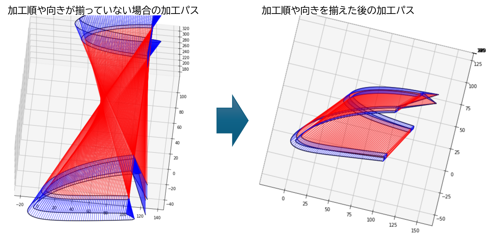

:toc: left
:toc-title: 目次
:toclevels: 5
:sectNums:
:sectNumLevels: 5

= HW CAM ユーザマニュアル

== 概要

=== 一般的なワークフロー
本ソフトでの一般的なワークフローを下図に示します。

本ソフトでGコード生成するのに必須なのはCADファイルの読み込みと、Gコード出力です。CADファイルが単純な形状の場合や、加工パスを考慮して作成されている場合などでは、CADファイルを読み込んで、そのままGコード出力が可能です。

CADの作図上は考慮されていないものの、熱線加工上必要となる設定については、CADファイルの読み込み後に必要な補正をかけてから、Gコードを出力します。現バージョンで対応している補正は以下です。

* 同着点指定
* 加工順指定
* 工具径補正（溶けしろ補正）
* 加工条件指定
* ワーク断面からのCNC駆動面座標作成（テーパー加工の場合必要）
* ワーク座標オフセット／回転

=== 画面の名称
本ユーザマニュアル内では、説明のため、画面内の要素を下図のように呼びます。

image::res/画面説明.png[]

=== グラフの操作
画面左側には、CADから読み込んだ線がグラフとして表示されます。グラフの描画にはMatplotlibを用いており、グラフの移動／拡大・縮小などは、グラフ下のツールバーから可能です。

ツールバーのアイコンについては、
https://matplotlib.org/3.2.2/users/navigation_toolbar.html[Matplotlibのドキュメント]を参照ください。

TIP: アイコンは、同じアイコンを再度クリックすると、選択が解除されます。

=== テーブルの操作
テーブルには、グラフ内の線の情報が表示されます。テーブル内の行をクリックすることで、線を選択できます。テーブルの行は、エクスプローラーと同様に、「Ctrl+クリック」「Shift+クリック」にて、複数の線を同時に選択できます。読み込んだ線が多い場合は、テーブル右端のスクロールバーを用いて、スクロールできます。また、ある行を選択した状態で、「↑」「↓」矢印キーを押すことで、上の行または下の行へ移動することもできます。

== CADデータ読み込み
加工したい形状を作図したCADデータを読み込みます。CADデータは、dxfファイルのみに対応しています。

NOTE: dwgの場合は、任意のdwg-dxfコンバーターを使用して、dxfに変換した後、インポートしてください。

TIP: CAD図面内の線は、一筆書きとなるように、向き／並び順を自動整列した状態で読み込まれます、

=== 読み込み方法
CADデータを読み込むには、エクスプローラーを用いる方法と、ファイルパスを直入力する方法の2通りがあります。

==== エクスプローラーによる読み込み
X-Yテーブル　または　U-Vテーブルの上の「開く」ボタンをクリックすると、エクスプローラーが開きます。エクスプローラーから、読み込みたいdxfファイルを指定し、「開く」をクリックすると読み込まれます。

NOTE: X-Y、U-Vのそれぞれで読み込みを行ってください。同じ図面（矩形）を加工する場合も、２断面で読み込みを行ってください。

image::res/エクスプローラー.png[]

==== ファイルパスによる読み込み
X-Yテーブル　または　U-Vテーブルの上の空欄に、dxfファイルのパスを直に入力して読み込むこともできます。この場合、パスを入力後に「再読込」ボタンをクリックすると読み込まれます。

TIP: パスは、絶対パス、相対パスのどちらにも対応しています。

image::res/直リンク.png[]

=== 座標点のリファイン
CADに取り込んだ翼型データの座標点数が少ない場合など、加工前に読み込んだ座標点を増やしたい場合があります。本ソフトでは、読み込み時に曲率に応じて座標点を細かく増やす機能（リファイン機能）を実装しています。「スプライン点列をリファインする」にチェックを入れたうえで、dxfファイルを読み込むことで、リファインした座標点でCAD図面が読み込まれます。すでにCAD図面を読み込んでいる場合は、「再読込」ボタンをクリックすることでリファインされます。

NOTE: リファイン時の補完方法は、一般的なCADやXFLRと同様に、3次スプライン補完です。

image::res/リファイン.png[]

== 加工パスの指定
CADで作図された図から不要な線を削除したり、同着点を指定するように線を分割／結合したりすることで、加工パスを生成します。

本ソフトでは、X-YテーブルとU-Vテーブルに表示される同じ行の線の端点を同時に通るように加工パスを生成します。例えば、前縁で線を分割するようにすることで、前縁を必ず同時に通るような加工パスを生成できます。

NOTE: 翼型混合率の変化がきつい場合では、前縁を同着しないと捻れた形状になる場合があります。

image::res/同着点.png[]

=== 線の削除
CAD図面に不要な線が含まれている場合は、CAM上で削除できます。テーブル上で該当する線をクリックして選択した後に、「ライン削除」ボタンをクリックすると線が削除されます。

TIP: 複数の線を選択した状態で「ライン削除」をクリックすると、複数の線を同時に削除できます。

image::res/ライン削除.png[]

=== 線の結合
XY断面とUV断面のCAD図面において、線の分割位置が異なる場合は、線を結合することで分割位置を揃えることができます。テーブル上で結合したい線をクリックした上で、「ライン結合」をクリックすると選択した線が結合されます。

TIP: 複数の線を選択した状態で「ライン結合」をクリックすると、複数の線を同時に結合できます。

WARNING: ライン結合がうまくいかない場合は、「ライン整列」により一筆書きとなるように線を並び替えてた上で、ライン結合を行ってください。

=== 線の分割
同着点を増やしたい場合などのため、線を分割することができます。線の分割は、以下の手順で実施します。

. テーブル上で分割したい線を選択する
. 画面上で分割したい点をクリックして選択する
. 「ライン分割」ボタンをクリックする

TIP: ライン分割は、１本ごとに行ってください。

TIP: 選択していない線（色の薄い線）上の点は選択できません。

image::res/ライン分割.png[]

== 加工順序の指定
加工順序や向きが揃っていないと、下図のように捻れた加工パスが生成されてしまい、意図した形状を整形できません。XY断面とUV断面で線の加工順序および向きが揃うようにします。

=== 最初に加工する線の指定
以下により、最初に加工したい線を起点として、テーブル内の線を並び替えます。

. テーブルにて最初に加工したい線を選択する
. 「ライン整列」ボタンをクリックする

TIP: 加工時の向きは、最初に選択した線の向きになります。これを変更する方法は、次項で説明します。

image::res/ライン整列.png[]

=== 加工方向の指定
加工を時計回りと反時計周りのどちらで行うかを指定します。

TIP: 加工方向は、グラフ上の矢印の向きで確認できます。直線は開始点のみ、スプラインは開始点と終点に矢印が表示されます。

image::res/加工方向.png[]

==== 最初に加工する線の向きからの指定
「ライン整列」は、最初に加工する線の向きに合うように、残りの線が並び替えられます。よって、最初に加工する線の向きを、加工したい方向に向けておくことで、加工方向を指定できます。以下により、加工方向を指定します。

. テーブルにて最初に加工したい線を選択する。
. 加工したい方向と逆向きの場合、「カット方向入れ替え」ボタンをクリックし、線の向きを入れ替える。
. 「ライン整列」ボタンをクリックする

image::res/ライン方向入れ替え.png[]

==== カット順反転による指定
時計回りと反時計周りを入れ替えたい場合は、「カット順逆転」ボタンにより、加工方向を反転できます。

image::res/カット順逆転.png[]

=== XY-UV画面連動による加工順の確認
「X-Y画面とU-V画面を連動させる」にチェックを入れると、XYテーブルの操作とUVテーブルの操作が同期します。同期した状態で、上から順に線を選択していくことで、線の対応関係が一致していることを確認できます。

なお、「X-Y画面とU-V画面を連動させる」にチェックを入れると、以下のボタンの操作も連動します。

* カット方向入れ替え
* ライン整列
* カット順逆転
* ライン結合
* ライン削除
* オフセット量設定

== 工具径補正

=== マニュアルによる補正
=== 加工速度による自動補正
==== 溶け量ファイルの作成（事前準備）
==== 溶け量ファイルの読み込み
==== カット速度の指定
==== 自動補正の適用
=== 自己交差除去機能

== 加工条件設定
=== 座標設定
==== 原点のオフセット
==== ワークの回転
=== 加工始点・終点の指定
=== カット速度の指定
==== CAMにおけるカット速度の指定
==== CNCコントローラーに合わせたカット速度の指定
=== 加工対象／CNC情報の入力

== カットパスの確認
=== 2Dによるパスチェック
=== 3Dによるパスチェック

== Gコード生成

== その他機能
=== コンフィギュレーション読み込み
=== メッセージウィンドウ
=== エラーログ出力